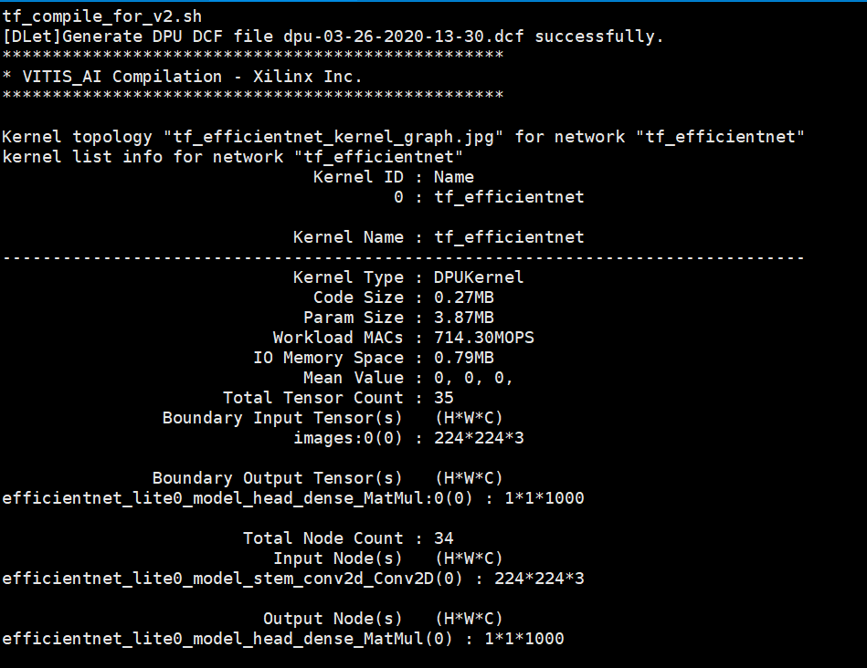

# lpcvc2020_water
The solution of the third prize of FPGA track in 2020 Low-Power Computer Vision Challenge([LPCVC](https://lpcv.ai/)). Designed by
>Water Group, State Key Laboratory of Computer Architecture, Institute of Computing Technology, Chinese Academy of Sciences, Beijing; University of Chinese Academy of Sciences.

>Shengwen Liang, Rick Lee

>liangshengwen@ict.ac.cn

>2020-08-20

## Prerequisites
* TF2.2 environment for train model
    - TensorFlow version = 2.2.0
    - Nvidia titan GPUs
    - ImageNet Dataset (tfrecoder format)
    
* Xilinx/Vitis-ai-cpu:docker 
    - Tensorflow version = 1.15.2
    - keras version = 2.2.5
    - Python version >= 3.6
    - ImageNet Dataset

## DPU configuration
B2304, 200/400MHz, RAM_USAGE_LOW, RELU_LEAKYRELU_RELU6, POOL_AVG_ENABLE, DWCV_ENABLE, DSP USAGE LOW.

## Train stage
Considering the trade-off between latency and accuracy, we leverage efficientnet-lite0 as a baseline model. However, due to the architecture of original efficientnet-lite0 provided by google cannot meet the requirement of DPU with B2304 and high RAM configuration, we change the architecture of efficientnet-lite0 as shown in, to ensure that the model can be deployed on the Ultra96-V2 board with DPU (B2304, high RAM).
<center class="half">
    
</center>
1. Run the following command to train modified efficientnet-lite0 model.

```bash
cd tpu/efficientnet/
sh dpu_train.sh
```

## Generate elf file for DPU stage
We leverage tensorflow-2.2.0 to train efficientnet-lite0 model and get the best accuracy (72.499%) when train step reach 2893563, and the checkpoint file is provided in checkpoint file. 

2. Generate frozen.pb file using checkpoint file
```bash
cd tpu/efficientnet/
python frozen.py
```
3. Evaluate the accuracy of frozen.pb on imagenet evalutation dataset. The accuracy is 72.64%. 
```bash
cp tpu/efficientnet/frozen.pb deploy/tf_efficientnet_lite_imagenet_224_224/float/
cd deploy/tf_efficientnet_lite_imagenet_224_224/code/eval/
sh 3_tf_eval_frozen_graph.sh 
```
4. Quantize frozen.pb
```bash
sh 4_tf_quantize.sh
```
5. Evaluate the accuracy of quantized model. The accuracy is 71.28% 
```bash
sh 5_tf_eval_quantize_graph.sh
```

6. Compile quantized model to generate elf file for dpu, we can get dpu_efficientnet.elf file in `deploy_output` folder. 
```bash
sh 6_tf_compile_for_v2.sh
```

## Deploy elf on Ultra96-V2 board.
7. Copy file to /CVPR_2020_DAY12_4thead_9/model/ file, and run test_accuracy_latency.ipynb to test accuracy and latency on Ultra96-V2 board. The thread is 4.

## Docker image
We provide a docker image in dokcer hub, which contains all source code except ImageNet dataset. You can start this dokcer image using `docker_run.sh` 

## Note
The Ultra96-V2 Board needs to update the PMIC firmware. Without the PMIC firmware update, the DPU will cause peak current that exceeds the default 4A fault threshold, causing the power on reset to assert, and thus the board to reboot.

## License
Apache License 2.0


